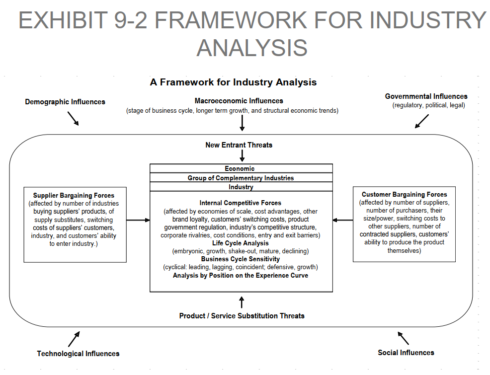
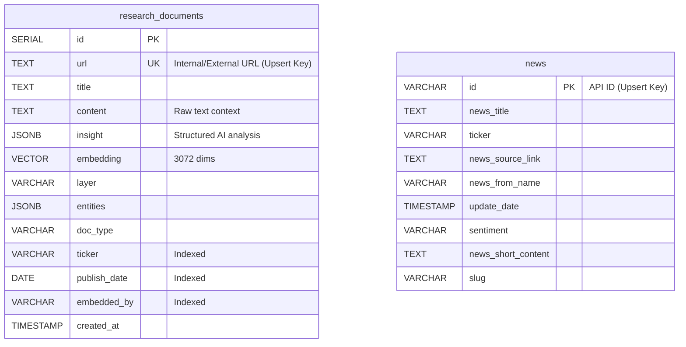

# Discord Bot Manager

A modular Python-based Discord bot system designed for financial market monitoring, news aggregation, automated report collection, and deep AI-driven market research. The project orchestrates multiple specialized modules to provide real-time updates and summarized insights directly to Discord.

---

## Problem Statement & Achievements

**Problem:** Tracking financial markets, aggregating news, parsing PDF reports, and conducting stock research manually is inefficient and time-consuming.

**Achievements:**
- **Automated Data Collection:** Scrapes financial news, downloads daily PDF reports from securities firms, and captures market dashboards for Discord delivery.
- **AI Research Pipelines:** Implements automated macro and micro market analysis workflows using LangGraph and LLMs.
- **Vector RAG Database:** Integrates PostgreSQL with `pgvector` for semantic search across research documents.
- **Resource Optimization:** Utilizes a database caching mechanism to bypass redundant API calls, reducing AI execution costs and processing time.

---

## 🌟 Core Modules

### 1. AI Market Researcher

An AI system that reads financial documents, searches the web, and answers questions about companies and markets.

- **Smart Search**: Finds information quickly by filtering for specific companies or dates before searching through the text meaning.
- **Date Finder**: Automatically reads web pages and PDFs to find exactly when the information was published.
- **Memory Check**: Before searching the web for a company, it remembers past research and uses it to give better answers.
- **Money & Time Saver (Cache)**: If it has already analyzed a company recently, it reuses the saved answer instead of reading everything again. This makes it 95% faster and saves AI costs.
- **Cost Tracker**: Counts exactly how much AI is used at each step to manage costs.

### 2. Discord Bot (`src/modules/bot_main/`)

The chat interface where you talk to the system.

- **Commands**:
  - `!news`: Get daily financial news.
  - `!tomtat`: Reply to any news message to get a short AI summary.
  - `!cleanup`: Delete duplicate messages.

### 3. News Summarizer (`src/modules/news_summarizer/`)

- Automatically reads the latest market news every hour, writes a quick summary, and sends it to Discord.
- Tracks real-time stock prices and trading volumes.

### 4. Report Collector (`src/modules/report_collecter/`)

- Runs every morning to download new PDF reports from top securities firms (like ACBS, KBSV, VCBS).
- Automatically saves the files and sends them straight to your Discord channel.

### 5. System Core (`src/core/`, `src/utils/`)

- **AI Manager**: Connects to Google Gemini and tracks all API usage to avoid high bills.
- **Database Helper**: Connects to PostgreSQL to save and search files efficiently.
- **Web Tools**: Sneaks past website blockers to safely scrape news and reports.

### 6. Vision Guard (`src/modules/vision_guard/`)

- Takes pictures of stock market dashboards every afternoon and sends them to Discord.

---

## 📂 Directory Structure

```text
├── ./
│   ├── main.py                # Main orchestrator entry point
│   ├── pytest.ini             # Pytest configuration
│   ├── DB_ARCH.md             # Database architecture documentation
│   ├── ARCHITECTURE.md        # Core project architecture documentation
│   ├── docs/                  # Project documentation
│   ├── scripts/               # Admin and sync scripts
│   │   └── migrations/        # Database pgvector schema (schema.sql)
│   ├── tests/                 # Test scripts (test_all_features.py)
│   ├── src/
│   │   ├── config/            # Centralized constants and settings
│   │   ├── core/              # Core systems
│   │   │   ├── ai/            # Google GenAI client and token trackers
│   │   │   ├── db/            # Database connections and Vector DB setup
│   │   │   ├── scraper/       # Base scanner, browser engine, HTTP client
│   │   │   └── logger.py      # Core logging module
│   │   ├── utils/             # Reusable helper functions (date_parser, ticker, text)
│   │   └── modules/           # Feature modules
│   │       ├── bot_main/      # Discord bot commands (Bot.py)
│   │       ├── deep_research/ # LangGraph nodes (Macro & Micro systems)
│   │       │   ├── company_nodes/ # Micro nodes (Cache, Profile, Finance, Storer, Synthesizer)
│   │       │   ├── nodes/         # Macro nodes (Translator, Retriever, Searcher, Dispatcher, Processor, Storer, Reporter)
│   │       │   └── tools/         # Tools (PDF/HTML Scraper, SearxNG API)
│   │       ├── news_summarizer/ # Scrapes and summarizes news (Firms_news.py)
│   │       ├── report_collecter/# Daily scraping of financial reports (daily_job.py)
│   │       └── vision_guard/  # Visual monitoring tasks (VisionGuard.py)
```

---

## 📐 System Architecture & Workflow

Here is the complete E2E system workflow depicting both **Macro & Sector System** and **Company Micro System** interacting with the central **pgvector RAG Database** and utilizing the optimized Cache Bypass.

```mermaid
graph TD
    classDef startEnd fill:#10b981,stroke:#059669,stroke-width:2px,color:#fff;
    classDef nodeClass fill:#1e293b,stroke:#0ea5e9,stroke-width:2px,color:#f1f5f9;
    classDef dbClass fill:#0284c7,stroke:#0369a1,stroke-width:2px,color:#fff;
    classDef decisionClass fill:#d97706,stroke:#b45309,stroke-width:2px,color:#fff;
    classDef skipClass fill:#ef4444,stroke:#dc2626,stroke-width:2px,color:#fff;

    Start(("Bắt đầu Yêu cầu")) --> QueryRouter{"Query Router / Phân loại Đầu vào"}

    %% -----------------------------------------
    %% SUBGRAPH 1: MACRO & SECTOR GRAPH (MAIN GRAPH)
    %% -----------------------------------------
    subgraph MacroSectorSystem ["LUỒNG PHÂN TÍCH VĨ MÔ VÀ NGÀNH - Main Research Graph"]
        QueryRouter -->|Truy vấn Vĩ mô hoặc Ngành| TranslatorNode["1. Translator Node (Phân tích và sinh 6-10 câu tìm kiếm)"]

        TranslatorNode --> MemoryRetrieverNode["2. Memory Retriever Node (Trích xuất Ticker - Lọc DB và nạp db_insights)"]

        MemoryRetrieverNode --> SearcherNode["3. Searcher Node (Tìm kiếm rộng qua SearxNG)"]

        SearcherNode --> DispatcherNode{"4. Dispatcher Node (Vòng lặp URLs)"}

        DispatcherNode -->|Còn URL| ProcessorCacheCheck{"Đã có trong DB?"}
        
        ProcessorCacheCheck -->|Chưa có| ProcessorNode["5. Processor Node (Scrape HTML/PDF và AI trích xuất)"]
        ProcessorCacheCheck -->|Đã có - Bypass| SkipScrape["Bỏ qua Scrape và AI Extract"]

        ProcessorNode --> StorerNode["6. Storer Node (Tạo Vector 3072 và Lưu DB)"]
        SkipScrape --> StorerNode

        StorerNode --> DispatcherNode

        DispatcherNode -->|Hết URL hoặc Đạt Giới hạn| ReporterNode["7. Reporter Node (AI tổng hợp insights mới và db_insights lịch sử)"]
    end

    %% -----------------------------------------
    %% SUBGRAPH 2: COMPANY MICRO GRAPH (COMPANY GRAPH)
    %% -----------------------------------------
    subgraph CompanySystem ["LUỒNG PHÂN TÍCH DOANH NGHIỆP - Company Graph"]
        QueryRouter -->|Mã cổ phiếu ví dụ VIC| CacheCheckerNode["Node 0: Cache Checker (Tra cứu URL và search_by_metadata lấy bản mới nhất)"]

        CacheCheckerNode --> ProfileCacheCheck{"Đã có Profile?"}

        ProfileCacheCheck -->|Chưa có| ProfileBuilderNode["Node 1: Profile Builder (Tìm Báo cáo thường niên/Cáo bạch và trích xuất report_date)"]
        ProfileCacheCheck -->|Đã có - Bypass| SkipProfile["Bỏ qua Tìm kiếm và Phân tích"]

        ProfileBuilderNode --> FinanceCacheCheck{"Đã có tài chính?"}
        SkipProfile --> FinanceCacheCheck

        FinanceCacheCheck -->|Chưa có| FinancialAuditorNode["Node 2: Financial Auditor (Kéo BCTC từ VCI và AI phân tích sức khỏe)"]
        FinanceCacheCheck -->|Đã có - Bypass| SkipFinance["Bỏ qua gọi API và phân tích tài chính"]

        FinancialAuditorNode --> CompanyStorerNode["Node 3: Company Storer (Tạo Vector 3072 và Lưu profile/BCTC theo Quý)"]
        SkipFinance --> CompanyStorerNode

        CompanyStorerNode --> ReportSynthesizerNode["Node 4: Report Synthesizer (AI liên kết dữ liệu lập Investment Memo)"]
    end

    %% -----------------------------------------
    %% CENTRAL DATABASE
    %% -----------------------------------------
    subgraph DatabaseSystem ["HỆ THỐNG CƠ SỞ DỮ LIỆU RAG - pgvector"]
        DB[(PostgreSQL Database - Bảng research_documents kèm các chỉ mục idx_ticker, idx_doc_type, idx_publish_date)]
    end

    %% DB Connections
    MemoryRetrieverNode -. "Truy vấn tương đồng vector" .-> DB
    ProcessorCacheCheck -. "Truy vấn URL Bypass" .-> DB
    StorerNode -->|Lưu tài liệu vĩ mô (nếu chưa có)| DB
    CacheCheckerNode -. "Truy vấn tương đồng metadata" .-> DB
    CompanyStorerNode -->|Lưu hồ sơ và BCTC (nếu chưa có)| DB

    %% Output
    ReporterNode --> FinalMacroReport[/"Báo cáo Vĩ mô và Ngành"/]
    ReportSynthesizerNode --> FinalMicroMemo[/"Investment Memo VIC / TCB"/]

    FinalMacroReport --> End(("Kết thúc"))
    FinalMicroMemo --> End

    class Start,End startEnd;
    class TranslatorNode,MemoryRetrieverNode,SearcherNode,ProcessorNode,StorerNode,ReporterNode nodeClass;
    class CacheCheckerNode,ProfileBuilderNode,FinancialAuditorNode,CompanyStorerNode,ReportSynthesizerNode nodeClass;
    class DB dbClass;
    class QueryRouter,ProcessorCacheCheck,ProfileCacheCheck,FinanceCacheCheck,DispatcherNode decisionClass;
    class SkipScrape,SkipProfile,SkipFinance skipClass;
```

---

## 📈 Financial & Industry Analysis Framework

To balance analytical depth with computational efficiency (context window and API cost constraints), the system implements a **simplified and flexible adaptation** of the **CFA Industry Analysis Framework (Exhibit 9-2)**:



### 1. Macro & Sector Analysis (Macro Graph)
* **Macroeconomic & Governmental Influences**: Automatically parsed in [translator.py](file:///F:/Projects/Discord_bot/src/modules/deep_research/nodes/translator.py) and summarized in [reporter.py](file:///F:/Projects/Discord_bot/src/modules/deep_research/nodes/reporter.py). The system tracks FED/ECB interest rates, inflation, exchange rates, monetary policy shifts, and key global commodity prices.
* **Supplier Bargaining Forces**: Evaluated via supply chain constraints, input cost fluctuations, and geopolitical bottlenecks.
* **Internal Competitive Forces & Technological Influences**: Monitors key industry players' strategies, M&A movements, and emerging technology disruptions.
* **Business Cycle Sensitivity**: Addressed through multi-scenario reporting (Positive, Negative, and Base cases) generated in [reporter.py](file:///F:/Projects/Discord_bot/src/modules/deep_research/nodes/reporter.py).

### 2. Company Micro Analysis (Company Graph)
* **Economic Moat (Internal Competitive Forces)**: Evaluated in [profile_builder.py](file:///F:/Projects/Discord_bot/src/modules/deep_research/company_nodes/profile_builder.py). The AI extracts and assesses the presence and strength of competitive advantages (e.g., Economies of Scale, Switching Costs, Brand Power) from annual reports.
* **Quantitative Health Assessment**: Evaluated in [financial_auditor.py](file:///F:/Projects/Discord_bot/src/modules/deep_research/company_nodes/financial_auditor.py). Measures key performance indicators like gross margins, Operating Cash Flow (CFO) trends, and debt-to-equity structures.
* **Synthesis & Thesis**: Combines qualitative and quantitative insights in [report_synthesizer.py](file:///F:/Projects/Discord_bot/src/modules/deep_research/company_nodes/report_synthesizer.py) to generate a concise, actionable investment thesis (*Investment Memo*).

---

## 🛠 Tech Stack

- **Language**: Python 3.10+
- **AI & Orchestration**: `google-genai` (Gemini API), `LangGraph`
- **Scraping & Data**: `playwright`, `pandas`, `vnstock`
- **Database**: PostgreSQL (`psycopg2-binary`, `asyncpg`, `pgvector` extension)
- **Bot Framework**: `discord.py`

---

## 💾 Database Architecture & Migrations

The system is powered by a PostgreSQL database with the `pgvector` extension, acting as both an application cache and a semantic RAG engine.

### Key Database Functions

- **Cross-Domain Semantic Search**: Employs a Single Table Design (`research_documents`) combining macro news and micro profiles to enable unified vector similarity searches.
- **Upsert & LLM Cache**: Uses `ON CONFLICT (url) DO UPDATE` to handle duplicate scrapes or re-analysis seamlessly, serving as an efficient bypass cache for the expensive LLM execution nodes.
- **Schema-less Flexibility**: Uses `JSONB` columns (`insight`, `entities`) to store varying LLM analysis outputs without altering the database schema.

### Entity-Relationship Diagram



- **Migrations**:
  - `migrate_rag_db.py`: Backfilled standard layers.
  - `migrate_metadata_filter.py`: Configures metadata columns, runs fallback backfills, and sets up high-speed indexes (`idx_ticker`, `idx_doc_type`, `idx_publish_date`) for dynamic filtering.

---

## 🛠 Utilities & Maintenance

- **`sync_reports.py`**: Syncs previously sent report history (using MD5 hashes of report titles) to avoid duplicate Discord notifications.
- **`check_db_status.py`**: Utility script to check for duplicates and total row counts in the `news` and `report` tables.

---

## 🚀 Building and Running

### Prerequisites

- Python 3.10+
- Playwright browsers: Run `playwright install`
- PostgreSQL server (with `pgvector` installed) configured in `.env`.
- Valid `.env` file with `DISCORD_TOKEN`, `GEMINI_API_KEY`, DB credentials, and Webhook URLs.

### Local Execution

1. Install dependencies:
   ```bash
   pip install -r requirements.txt
   ```
2. Run database migration (if starting fresh):
   ```bash
   python src/modules/deep_research/db/migrate_metadata_filter.py
   ```
3. Run the orchestrator:
   ```bash
   python main.py
   ```

### Using the Bot

- **`!news`**: Fetches the latest financial news summaries.
- **`!tomtat`**: Reply to a news message to receive a concise AI summary.
- **`!profile <TICKER>`**: Fetches the company profile and financial health analysis.
- **`!research <QUERY> [attachment.md]`**: Conducts deep market research. You can attach a markdown file containing custom insights to inject context.

### API Cost Optimization (RAG Cache Retrieval Bypass)

The system incorporates a highly optimized RAG Cache Bypass mechanism. Before web scraping or vector embedding generation (which consumes Gemini API tokens), the workflow queries the PostgreSQL database via `url` or metadata matching. If the data is already cached, it bypasses the execution of expensive nodes (`processor`, `storer`) and loads the `insight` directly from the database. This eliminates redundant API calls and minimizes AI costs.

### Running Tests

- **Integration Tests (Metadata RAG)**: Run 3 consecutive test suites to verify embedding insertion, date parsing, vector filters, and metadata check skips:
  ```bash
  python scratch/test_metadata_rag.py
  ```
- **Company Graph Test (Micro Research)**:
  ```bash
  python run_test_company.py
  ```
- **Research Graph Test (Macro Research)**:
  ```bash
  python run_test_research.py
  ```

---

## 🔮 Future Improvements & Unresolved Issues

This section outlines technical debt, missing features, and optimization opportunities in the current system:

### 1. Semantic Chunking & Tagging

Currently, whole documents are embedded as single large vectors. A chunking strategy (splitting by paragraphs or semantic blocks) combined with comma-separated tag structures needs to be implemented to improve context retrieval accuracy.

### ~~2. Conditional Routing in LangGraph~~ [RESOLVED]

~~The `company_graph.py` runs sequentially. Even if `cache_checker` finds cached data, it does not truly skip the graph's execution path via `add_conditional_edges`, wasting node initialization cycles.~~
_(Resolved: Implemented `add_conditional_edges` in `company_graph.py` with granular `profile_from_cache` and `finance_from_cache` state flags to bypass unnecessary API nodes.)_

### ~~3. AI Error Handling & Retry Logic~~ [RESOLVED]

~~If Gemini AI timeouts or hits a rate limit, nodes return an `{"error": ...}` dict and the graph proceeds. There is no retry logic or robust fallback mechanism for API failures.~~
_(Resolved: Integrated `tenacity` library in `tracker.py` to auto-retry LLM calls 3 times with exponential backoff. Added a graceful fallback returning `{"error": "AI unavailable"}` to prevent graph failure after exhausted retries.)_

### 4. Vector Model Migration Scripts

If the embedding model is upgraded, existing vectors will become obsolete. A `re_embed_database.py` script is needed to recompute embeddings for all legacy data without downtime.

### 5. Data Lifecycle & Cleanup

The `insert_document` upserts data, but there's no expiration or archival strategy for outdated reports (e.g., decaying vector weights or periodic cleanup jobs).

### 6. Token-based Pagination

`search_with_filters` returns a fixed number of records (e.g., limit=5). If all 5 documents are huge, it crashes the LLM context window. Results should be limited by total token count.

### 7. Discord Rate Limiting & Queueing

The `/research` command lacks a task queue. Concurrent requests from multiple users can crash the bot or hit API rate limits.

### ~~8. SSRF & Web Scraping Timeouts~~ [RESOLVED]

~~The `pdf_scraper` blindly trusts URLs from SearxNG. It lacks blacklist filtering (for internal IP protection) and a hard global timeout to prevent infinite hanging.~~
_(Resolved: Added `security.py` with `is_safe_url` resolving hostnames to IPs and blocking private/local subnets. Enforced a hard Global Timeout of 30s/45s using `ThreadPoolExecutor` to kill hanging scrape attempts.)_

### 9. Follow-up Chat (Conversational Memory)

The Discord bot provides a one-off report. It does not store session context in the database, meaning users cannot ask follow-up questions about the generated research.

### 10. Annual Report Smart Extraction

Implement a noise-filtering pipeline for PDF annual reports:

- **TOC Detection**: 3-tier fallback (PDF Bookmarks -> Synonym Dictionary -> Regex Structural Match `^.+?(?:\.{3,}|\s+)\d+\s*$`).
- **Dictionary Filtering**: Keyword mappings to drop "junk" pages (e.g., board of directors, biographies).
- **LLM Extraction**: RAG-based extraction for core "Business Philosophy" and "Yearly Goals" on the cleaned text subset.
