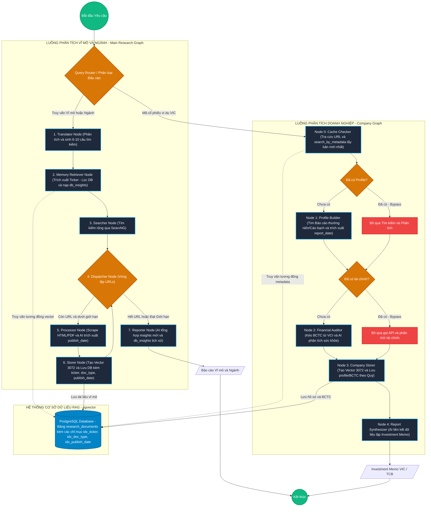

# Discord Bot Manager

A modular Python-based Discord bot system designed for financial market monitoring, news aggregation, automated report collection, and deep AI-driven market research. The project orchestrates multiple specialized modules to provide real-time updates and summarized insights directly to Discord.

---

## 🌟 Core Modules

### 1. Deep Research & Metadata Filtering RAG Engine (v2.0)

An advanced, cost-optimized Retrieval-Augmented Generation (RAG) system for corporate and market analysis built on **LangGraph**:

- **Hybrid RAG & Metadata Filtering (New)**: Adds PostgreSQL (`pgvector`) metadata columns (`ticker`, `doc_type`, `publish_date`) and fast indexes. Supports vector similarity search restricted by tickers, document types, or specific date ranges (`search_with_filters`).
- **Chronological Date Extraction**: Uses structured Gemini prompts to extract `publish_date` and `report_date` from web sources and PDF annual reports. Normalizes quarter data (e.g. `Q3/2024` $\rightarrow$ `30/09/2024`) and year data (e.g. `2024` $\rightarrow$ `31/12/2024`) via a robust parser.
- **Memory Retriever Node**: Intercepts the Macro Research Graph right after query translation. Detects stock symbols (e.g. `VIC`, `TCB`), performs filtered vector database queries, and loads historical insights into the state (`db_insights`) for comparative analysis.
- **Optimal Resource Caching (Cache Bypass)**: The Company Graph (`company_graph.py`) first checks the DB (`cache_checker`). If a company profile or financial insight exists, it **bypasses and skips all web searches, PDF scraping, and LLM analysis nodes**, saving up to **95% of execution time and API token costs**.
- **Chained Node-Level Token Tracking**: Estimates and records total input/output tokens and request counts per node.

### 2. Discord Bot (`src/modules/bot_main/`)

The primary interface for users to interact with the system.

- Commands:
  - `!news [YYYY-MM-DD]`: Fetches news for a specific date or range.
  - `!tomtat`: (Reply to a news embed) Provides an AI-generated summary of the article using Gemini.
  - `!cleanup`: Removes duplicate news/report embeds from the channel.

### 3. News Summarizer (`src/modules/news_summarizer/`)

- Periodically fetches news (via `VCI_news`) and sends alerts to a Discord webhook.
- Uses `vnstock` for real-time stock status (price, volume, change).

### 4. Report Collector (`src/modules/report_collecter/`)

- Orchestrates daily scraping and delivery of financial reports.
- **Scanners**: Supports ACBS, KBSV, VCBS, SSI, VietCap.
- **BaseScanner Architecture**: Uses an object-oriented approach where `BaseScanner` handles generic tasks (session management, CSV loading, PDF downloading, deduplication) to reduce redundant code across scraper modules.
- Filters and sends yesterday's reports to Discord webhooks with PDF attachments.

### 5. Core Utilities & Configurations (`src/utils/`, `src/config/`)

- **LLM Token Tracking**: `call_llm_with_tracking` in `llm_utils.py` manages API calls, automatically tracking input/output tokens and request counts across all AI nodes.
- **API Singleton**: `genai_client.py` provides a unified `genai.Client` to optimize connection usage.
- **Centralized Constants & Utils**: Centralized `const.py` for Discord embed colors and model identifiers. `ticker_utils.py` handles generic stock symbol extraction to prevent duplication across modules.

### 6. Vision Guard (`src/modules/vision_guard/`)

- Handles visual monitoring or automated screenshots of financial charts/dashboards.

---

## 📂 Directory Structure

```text
├── ./
│   ├── main.py                # Main orchestrator entry point
│   ├── run_test_*.py          # Testing scripts for Macro/Micro graphs
│   ├── sync_reports.py        # Deduplication utility
│   ├── db_summary_view.txt    # Database summary
│   ├── src/
│   │   ├── core/              # DB, GenAI singleton, Logger
│   │   ├── config/            # Centralized constants and settings
│   │   ├── utils/             # Helpers (LLM token tracking, web scraping base)
│   │   ├── modules/           # Feature modules
│   │   │   ├── bot_main/      # Discord bot commands and events
│   │   │   ├── deep_research/ # LangGraph nodes (Macro & Micro systems)
│   │   │   │   ├── company_nodes/ # Micro nodes (Profile, Finance)
│   │   │   │   ├── nodes/         # Macro nodes (Search, Scrape, Report)
│   │   │   │   ├── tools/         # Tools (PDF/HTML Scraper, SearxNG API)
│   │   │   │   ├── db/            # pgvector schema and migrations
│   │   │   ├── news_summarizer/ # Scrapes and summarizes news
│   │   │   │   ├── scanners/    # Source-specific news scrapers
│   │   │   ├── report_collecter/# Daily scraping of financial reports from brokers
│   │   │   │   ├── scanners/    # Broker-specific PDF scrapers
│   │   │   ├── vision_guard/  # Visual monitoring tasks
```

---

## 📐 System Architecture & Workflow

Here is the complete E2E system workflow depicting both **Macro & Sector System** and **Company Micro System** interacting with the central **pgvector RAG Database** and utilizing the optimized Cache Bypass.



---

## 🛠 Tech Stack

- **Language**: Python 3.10+
- **AI & Orchestration**: `google-genai` (Gemini API), `LangGraph`
- **Scraping & Data**: `playwright`, `pandas`, `vnstock`
- **Database**: PostgreSQL (`psycopg2-binary`, `asyncpg`, `pgvector` extension)
- **Bot Framework**: `discord.py`

---

## 💾 Database Architecture & Migrations

The system is powered by a PostgreSQL database (`news_aggregator`) with the `pgvector` extension.

- **Core DB Utilities**: `src/core/db.py` provides synchronous and asynchronous connection helpers.
- **Standard Tables**: `news` and `report` store aggregated market news and scraped financial reports. Detailed schema is available in `Database/Schema.md`.
- **RAG Schema (`src/modules/deep_research/db/schema.sql`)**: Contains the `research_documents` table with advanced columns (`ticker`, `doc_type`, `publish_date`, `layer`, `entities`).
- **Migrations**:
  - `migrate_rag_db.py`: Backfilled standard layers.
  - `migrate_metadata_filter.py`: Configures metadata columns, runs fallback backfills, and sets up high-speed indexes for dynamic filtering.

---

## 🛠 Utilities & Maintenance

- **`sync_reports.py`**: Syncs previously sent report history (using MD5 hashes of report titles) to avoid duplicate Discord notifications.
- **`check_db_status.py`**: Utility script to check for duplicates and total row counts in the `news` and `report` tables.

---

## 🚀 Building and Running

### Prerequisites

- Python 3.10+
- Playwright browsers: Run `playwright install`
- PostgreSQL server (with `pgvector` installed) configured in `.env`.
- Valid `.env` file with `DISCORD_TOKEN`, `GEMINI_API_KEY`, DB credentials, and Webhook URLs.

### Local Execution

1. Install dependencies:
   ```bash
   pip install -r requirements.txt
   ```
2. Run database migration (if starting fresh):
   ```bash
   python src/modules/deep_research/db/migrate_metadata_filter.py
   ```
3. Run the orchestrator:
   ```bash
   python main.py
   ```

### Running Tests

- **Integration Tests (Metadata RAG)**: Run 3 consecutive test suites to verify embedding insertion, date parsing, vector filters, and metadata check skips:
  ```bash
  python scratch/test_metadata_rag.py
  ```
- **Company Graph Test (Micro Research)**:
  ```bash
  python run_test_company.py
  ```
- **Research Graph Test (Macro Research)**:
  ```bash
  python run_test_research.py
  ```

---

## 🔮 Future Improvements & Unresolved Issues

This section outlines technical debt, missing features, and optimization opportunities in the current system:

### 1. Semantic Chunking & Tagging
Currently, whole documents are embedded as single large vectors. A chunking strategy (splitting by paragraphs or semantic blocks) combined with comma-separated tag structures needs to be implemented to improve context retrieval accuracy.

### ~~2. Conditional Routing in LangGraph~~ [RESOLVED]
~~The `company_graph.py` runs sequentially. Even if `cache_checker` finds cached data, it does not truly skip the graph's execution path via `add_conditional_edges`, wasting node initialization cycles.~~
*(Resolved: Implemented `add_conditional_edges` in `company_graph.py` with granular `profile_from_cache` and `finance_from_cache` state flags to bypass unnecessary API nodes.)*

### 3. AI Error Handling & Retry Logic
If Gemini AI timeouts or hits a rate limit, nodes return an `{"error": ...}` dict and the graph proceeds. There is no retry logic or robust fallback mechanism for API failures.

### 4. Vector Model Migration Scripts
If the embedding model is upgraded, existing vectors will become obsolete. A `re_embed_database.py` script is needed to recompute embeddings for all legacy data without downtime.

### 5. Data Lifecycle & Cleanup
The `insert_document` upserts data, but there's no expiration or archival strategy for outdated reports (e.g., decaying vector weights or periodic cleanup jobs).

### 6. Token-based Pagination
`search_with_filters` returns a fixed number of records (e.g., limit=5). If all 5 documents are huge, it crashes the LLM context window. Results should be limited by total token count.

### 7. Discord Rate Limiting & Queueing
The `/research` command lacks a task queue. Concurrent requests from multiple users can crash the bot or hit API rate limits.

### 8. SSRF & Web Scraping Timeouts
The `pdf_scraper` blindly trusts URLs from SearxNG. It lacks blacklist filtering (for internal IP protection) and a hard global timeout to prevent infinite hanging.

### 9. Follow-up Chat (Conversational Memory)
The Discord bot provides a one-off report. It does not store session context in the database, meaning users cannot ask follow-up questions about the generated research.

### 10. Annual Report Smart Extraction
Implement a noise-filtering pipeline for PDF annual reports:
- **TOC Detection**: 3-tier fallback (PDF Bookmarks -> Synonym Dictionary -> Regex Structural Match `^.+?(?:\.{3,}|\s+)\d+\s*$`).
- **Dictionary Filtering**: Keyword mappings to drop "junk" pages (e.g., board of directors, biographies).
- **LLM Extraction**: RAG-based extraction for core "Business Philosophy" and "Yearly Goals" on the cleaned text subset.
